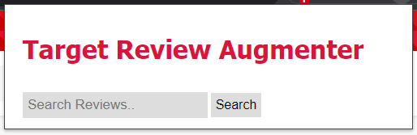
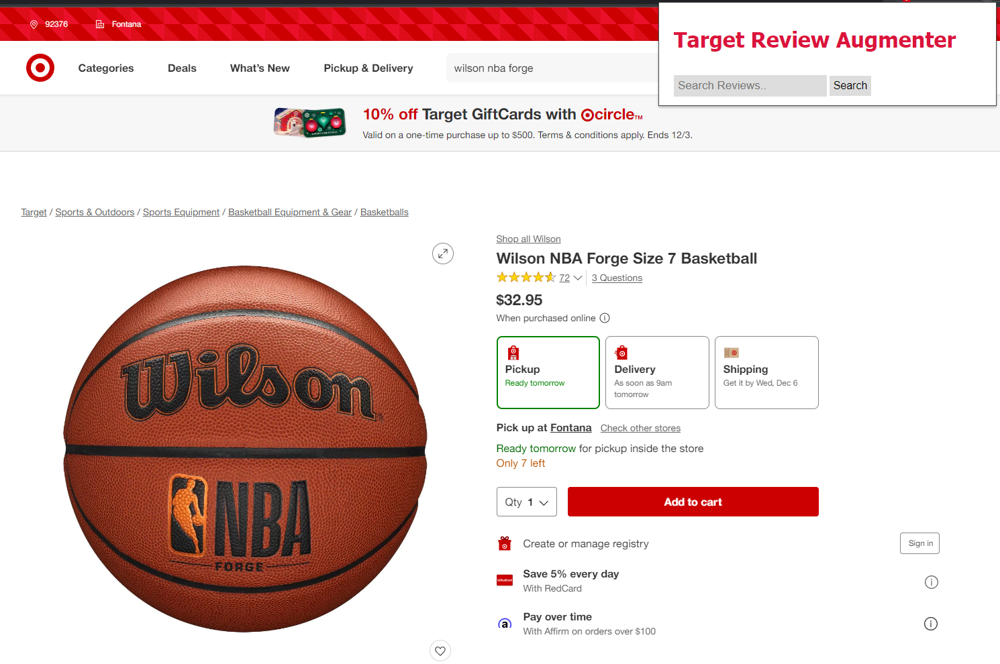
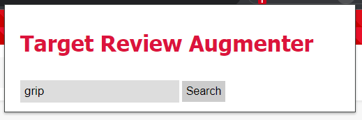
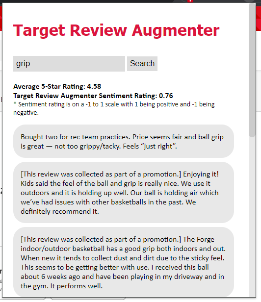

# CS410_Project_Review_Augmenter

Chrome extension to augment Target.com with BM25 search on product reviews and a product review sentiment score.

## Overview 

The primary function of the Target Review Augmenter is to enable a user with BM25 search over a collection Target.com of product reviews. The extension will take a query from the user, 
fetch the product reviews from the Target product page they are currently on, query the reviews using BM25, and display the top results to the user. This allows the user
to more intelligently search through product reviews to answer any questions they may have about a product.

Additionally, this extension will calculate an aggregated sentiment score over all of the reviews for a given product and display this to the user. This allows the user to compare
the average star rating that Target provides for a product with the sentiment score as a second opinion on the quality of the product.

### Use

Upon opening the extension the user is greeted with a search box and a search button.


To use the extension, navigate to a Target.com product page that has reviews. For example: https://www.target.com/p/wilson-nba-forge-size-7-basketball/-/A-82153614#lnk=sametab


Next type a query into the search bar and select the Search button to submit the query.


Wait a few seconds for the extension to retrieve the reviews and then the query results will be displayed:


The results are displayed in order of relevance. Additionally, the average 5-star rating provided by target is 
displayed as well as the sentiment rating score.

## Implementation

### Chrome Extension
This extension was implemented as a Chrome extension following the guidelines here https://developer.chrome.com/docs/extensions/mv3/getstarted/. This means that the 
interface was developed using HTML and styled with CSS. The button and search UI functionality is controlled by JavaScript. 
The root directory of this project contains a `manifest.json` which allows this project to be detected as a Chrome extension
and defines basic extension properties such as the name and version.

### Flask
To run the BM25 search algorithm and generate a sentiment score, several Python libraries were used. In order to call functions
using these Python libraries from JavaScript, Flask was used. Flask is essentially a server that runs in Python and allows
JavaScript to make requests to it to run Python code. The JavaScript will take the search query as well as the URL of the 
Target.com product page and send a request to the Flask server with those as parameters.

### RedCircle API
Once the Flask server receives the request with the search query and the product URL, the server will fetch the reviews
from that product page using the RedCircle API. The RedCircle API is a third-party API that can be used to fetch a list of
reviews for a Target product given the product page URL. This request is made with the Python Requests library. The request 
returns the reviews in JSON format which the server parses into a Python array. The JSON also includes the Target 5-star rating
of the product.

### Preprocessing

Once the list of reviews is collected, the review text for each review is preprocessed.
Preprocessing is done using several functions from the Natural Language Toolkit (NLTK). Firstly, the review is tokenized
using the `word_tokenize` function in NLTK. The stop words are removed using NLTK's collection of stop words. Finally, each
review is stemmed using the `PorterStemmer` in NLTK.

### BM25

After the reviews are preprocessed, the reviews and the query the user typed in and got sent to the Flask server are used
together to search the reviews using BM25 search. Originally the Metapy implementation of BM25 was going to be used. However, 
Metapy seemingly randomly crashed when being called from the Flask server. Metapy also did not provide a way to query a list
of documents on the fly, the documents must be written to a file on the disk. This led to an inelegant design of writing
the list of reviews to disk just to query them and delete them after. Due to these two issues, it was decided that Metapy was 
not the right library for this use case.

Instead, the Rank_BM25 Python library was used to perform the BM25 search. This library has a BM25Okapi function that allows
the user to pass in a Python list of documents and query to search with. This function also allows the user to tweak the k1 
and b BM25 parameters. The values for these parameters were taken from a previous MP assignment, MP2.2. This assignment involved
optimizing a ranking function to perform well on a series of tasks. BM25 was optimized to `k1=1.7` and a `b=0.71`. Since these
parameter values performed well on a variety of tasks, the same parameter values were used for the BM25 search in this extension.

Once the list of reviews are ranked by Rank_BM25, the reviews are packaged into a JSON and returned by the Flask server 
to be displayed by the JavaScript that made the search request to the Flask server.

### Sentiment Analysis

A sentiment score is also calculated for each preprocessed review. This is done using NLTK's `SentimentIntensityAnalyzer`. 
This function uses VADER which is a rule-based sentiment analysis system that produces 3 sentiment scores for given text. One 
of these scores is a compound score which ranges from -1 to 1 with 1 indicating the text was positive and -1 indicating negative text.

To aggregate the VADER scores for each document a weighted average is calculated with the weight being the number of words
in a review. The thought is that longer reviews might provide a more accurate sentiment score since the user was more thorough in writing
the review and the longer review provides more data to the `SentimentIntensityAnalyzer` to make a more accurate sentiment score.
However, we don't want a review to be weighted too heavily simply because it was longer, otherwise one long review would largely determine
the entire sentiment score for a product. Thus, the weight is limited to 50 to still give longer reviews slightly more weight
but not make them too dominant. 

This gives us this equation for the aggregated sentiment score:

```math
Aggregated  Sentiment(reviews) = (\sum_{k=1}^{length(reviews)} min(length(reviews_k), 50) * SentimentIntensityAnalyzer(reviews_k)) / length(reviews)
```

This final aggregated sentiment score is packaged in the same JSON the ranked reviews are sent in along with the 5-star
Target score to be displayed to the user via JavaScript.

### Key Components:
* Google Chrome Extensions: https://developer.chrome.com/docs/extensions/mv3/getstarted/
* Flask: https://github.com/pallets/flask
* RedCircle API: https://www.redcircleapi.com/
* Rank_BM25: https://github.com/dorianbrown/rank_bm25/
* NLTK: https://www.nltk.org/


## Setup
   
This Chrome extension runs with a Python backend and uses a Flask webserver to allow JavaScript to call Python code. The Python code makes requests to the RedCircle API to get Target product review data.

To run this extension we need to first add the extension to Chrome, run the Flask server included in this repo, and add a RedCircle API key.

 * 1\. Clone this repo to your local machine.
 * 2\. Load the extension in Chrome: https://developer.chrome.com/docs/extensions/mv3/getstarted/development-basics/
   * Go to chrome://extensions
   * Enable developer mode with the switch in the top right
   * Click "Load unpacked"
   * Select the cloned CS410_Project_Review_Augmenter folder
     * This folder should contain the manifest.json
   * Now the extension is in Chrome. It is helpful to pin the extension during use by selecting the extensions menu in Chrome and selecting the pin icon. See https://developer.chrome.com/docs/extensions/mv3/getstarted/development-basics/ for more details.
 * 3\. Set up the Python environment as follows:
   * Download Conda:
     * Windows: https://docs.anaconda.com/free/anaconda/install/windows/
     * MacOS: https://docs.anaconda.com/free/anaconda/install/mac-os/
   * From the CS410_Project_Review_Augmenter directory, clone the Conda environment for this project using the environment.yml with this command: `conda env create -f environment.yml`
   * Activate the environment: `conda activate cs410-35`
 * 4\. Set up the RedCircle API key to retrieve reviews for a given product.
   * Create a free acount on the RedCircle API website: https://www.redcircleapi.com/
   * Log into your account and click on the "API Playground" tab on your account page.
   * Copy the API key in the upper right corner.
   * In your cloned CS410_Project_Review_Augmenter folder, navigate to the `CS410_Project_Review_Augmenter/python` directory and open the `config.py` file in any editor.
   * Paste the copied API key into the `api_key` variable defined in `config.py`.
   * `config.py` should now look like this:
     * ```
       api_key = "YOUR_COPIED_API_KEY"
       ```
   * This free RedCircle account will give you 100 free requests for testing. A request is made every time a query is submitted via the "Search" button.
 * 5\. Run the Flask Server
   * From the `CS410_Project_Review_Augmenter/python` directory with the cs410-35 environment active run: `python python/flaskapp.py`
   * The Flask server is now running
 * 6\. The extension is now ready to use in Chome

When done using the extension close the server with ctrl-c. To use the extension in the future, run the flaskapp server before use.

## Contributors
Ethan Howes - edhowes2@illinois.edu

This project was solely completed by Ethan Howes on a 1-person team.
